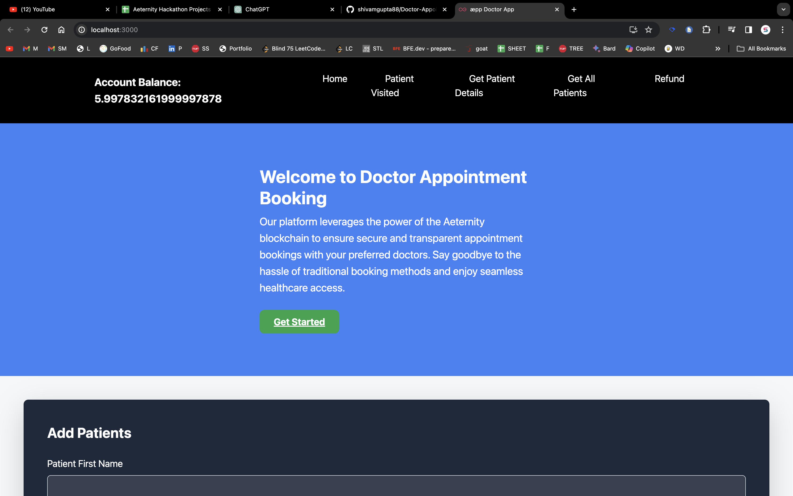
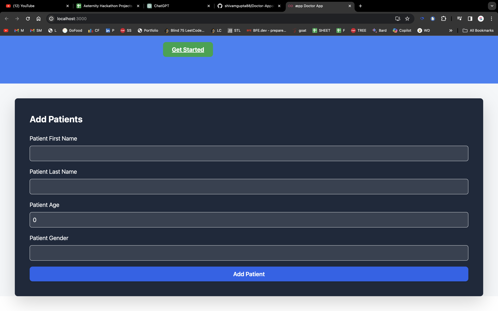
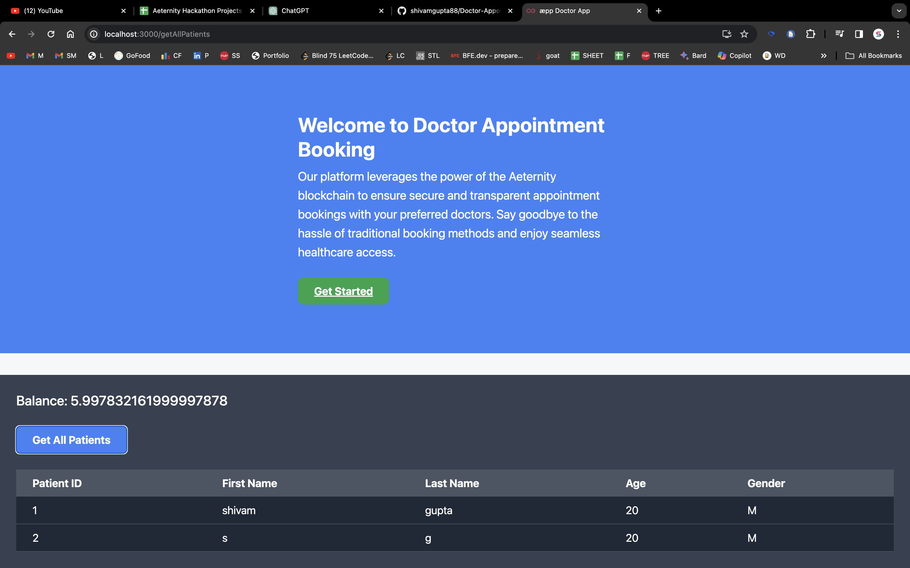

# Doctor Appointment Booking WebApp
https://draeternityw3.netlify.app/
### Install the below extension to do the transaction
https://chromewebstore.google.com/detail/superhero/mnhmmkepfddpifjkamaligfeemcbhdne

Welcome to the Doctor Appointment Booking WebApp, a decentralized platform powered by Aeternity Blockchain, designed to streamline the process of booking medical appointments. This application allows patients to register and book appointments seamlessly while providing doctors with an efficient tool to manage visits and handle payments securely.

## Features

- **Patient Registration**: Anyone can add patients to the system, including their first name, last name, age, gender, and payment status.
- **Appointment Booking**: Patients can book appointments, with each booking recorded on the Aeternity Blockchain for transparency and security.
- **Patient Details**: Retrieve detailed patient information using their unique ID, including visitation and payment status.
- **Visit Confirmation**: Exclusive to doctors, this feature allows marking patients as visited after their appointment in the clinic.
- **Fee Refund**: In cases where a visit does not occur, the doctor has the option to refund the registration fee, ensuring fairness and flexibility.

## Technology Stack

- **Frontend**: React - for building a dynamic and responsive user interface.
- **Smart Contract**: Sofia - Aeternity Blockchain's powerful language for creating immutable and secure contracts.
- **Blockchain**: Aeternity - Utilized for secure transactions, storing patient records, and handling payments.

## Getting Started

To get started with the Doctor Appointment Booking WebApp, follow these steps:

1. **Clone the Repository**

   ```bash
   git clone https://github.com/shivamgupta88/Doctor-Appoinment-Booking-W3app

   cd doctor-appointment-booking-w3app

Install Dependencies

Navigate to the project directory and install the necessary dependencies:

bash
Copy code
npm install
Configure Blockchain Environment

Set up your Aeternity node and compile the smart contract (DoctorAppointment.aes) using the Aeternity development tools.

Start the Application

Run the following command to start the application:
	
   	npm start

Configure Blockchain Environment

Set up your Aeternity node and compile the smart contract (DoctorAppointment.aes) using the Aeternity development tools.

Start the Application

Run the following command to start the application:

		npm start

This will launch the Doctor Appointment Booking WebApp on http://localhost:3000.

## Smart Contract Code

			contracts/DrApp.aes

### Screenshots

#### Homepage



#### Add Patients Page




#### Get All Patients list Page





	
